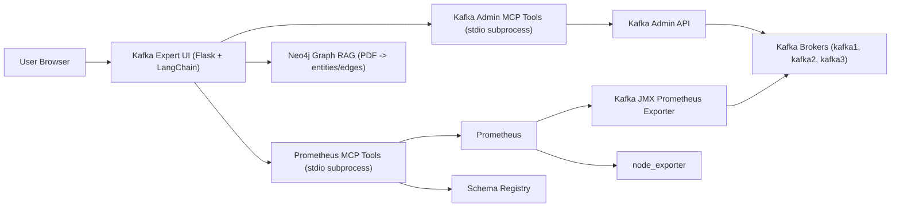

# aagentic-kafka-expert-demo 

Author: `Paul Harvener`  
Company: `Data-Blitz Inc`

## Overview
This demo runs a complete Kafka + Schema Registry stack with UI-driven Avro message production and consumption.
Consumed messages are persisted to CouchDB.
Kafka JMX data is exported to Prometheus and visualized in Grafana.
It also includes a LangChain-based Kafka Expert agent UI that uses MCP tools for Prometheus telemetry, Kafka Admin metadata/mutations, and Schema Registry inventory.

It is designed for local use with Docker Compose only.

## License
This project is controlled by the MIT License.

See:
- `./kafka-expert/LICENSE`

## What Runs
- 3-node Kafka cluster (KRaft mode, Confluent images)
- Confluent Schema Registry
- Kafka UI
- CouchDB (for consumed-message persistence)
- Kafka JMX Prometheus exporter (`/metrics`)
- node_exporter (`/metrics` for host/filesystem telemetry)
- Prometheus (scrapes JMX exporter + node_exporter)
- Prometheus alert rules for disk, request latency, ISR, and leader health
- Grafana (provisioned Prometheus datasource + dashboard)
- Neo4j (Graph RAG graph store for PDF-derived entities/edges)
- Producer UI (Avro producer + schema editor)
- Consumer UI (pretty JSON feed + consume latency)
- Kafka Expert UI (LangChain agent + MCP Prometheus + Kafka Admin tools + Neo4j Graph RAG + Kafka-only chatbot)
- Embedded Prometheus MCP tool server (started by Kafka Expert UI process)
- Embedded Kafka Admin MCP tool server (started by Kafka Expert UI process)
- Schema bootstrap job (registers schema at startup)

## Architecture
- Kafka brokers:
  - `localhost:19092`
  - `localhost:29092`
  - `localhost:39092`
- Schema Registry:
  - `http://localhost:8081`
- Kafka UI:
  - `http://localhost:8080`
- CouchDB:
  - `http://localhost:5984`
- JMX Exporter metrics:
  - `http://localhost:9404/metrics`
- Prometheus:
  - `http://localhost:9090`
- node_exporter metrics:
  - `http://localhost:9100/metrics`
- Grafana:
  - `http://localhost:3000` (`admin` / `demo` by default)
  - JMX dashboards:
    - `http://localhost:3000/d/kafka-jmx-overview/kafka-jmx-overview`
    - `http://localhost:3000/d/kafka-jmx-throughput/kafka-jmx-throughput`
    - `http://localhost:3000/d/kafka-jmx-request-latency/kafka-jmx-request-latency`
    - `http://localhost:3000/d/kafka-jmx-repl-health/kafka-jmx-replication-health`
    - `http://localhost:3000/d/kafka-jmx-jvm-os/kafka-jmx-jvm-and-os`
    - `http://localhost:3000/d/kafka-jmx-all-control-cluster/kafka-jmx-all-attributes-control-and-cluster`
    - `http://localhost:3000/d/kafka-jmx-all-broker-network/kafka-jmx-all-attributes-broker-and-network`
    - `http://localhost:3000/d/kafka-jmx-all-storage-coordination/kafka-jmx-all-attributes-storage-and-coordination`
    - `http://localhost:3000/d/kafka-observability-control-plane/kafka-observability-control-plane`
  - The 3 `Kafka JMX All Attributes` dashboards partition and cover all exported `kafka.*` numeric JMX attributes.
- Producer UI:
  - `http://localhost:5050`
- Consumer UI:
  - `http://localhost:5051`
- Neo4j:
  - Browser: `http://localhost:7474`
  - Bolt: `bolt://localhost:7687`
- Kafka Expert UI:
  - `http://localhost:5052`

## Kafka Expert Diagram

## Compose-Only Policy
Run everything through Docker Compose.  
Do not run Python scripts directly on host.

## Quick Start
1. `cd /Users/paulharvener/workspace/kafka-expert`
2. Set GenAI credentials in `.env`:
   - `OPENAI_API_KEY=...`
   - `OPENAI_MODEL=gpt-5.3` (or another available model in your account)
   - `OPENAI_MODEL_FALLBACKS=gpt-5.2,gpt-4.1` (used automatically if requested model is unavailable)
   - Optional: `OPENAI_BASE_URL=...` for OpenAI-compatible gateways
   - Neo4j Graph RAG credentials:
     - `NEO4J_USER=neo4j`
     - `NEO4J_PASSWORD=...`
     - `NEO4J_AUTH=none` (demo auto-login mode for Neo4j Browser; no username/password prompt)
     - `NEO4J_BROWSER_PUBLIC_URL=http://localhost:7474/browser/`
3. `docker compose up -d --build --remove-orphans`
4. Open producer UI: `http://localhost:5050`
5. Open consumer UI: `http://localhost:5051`
6. Open Kafka Expert UI: `http://localhost:5052`

## How To Use The Demo

### 1) Send messages manually
In Producer UI (`http://localhost:5050`):
- Click `Send One Message` (green button).

In Consumer UI (`http://localhost:5051`):
- You will see the message displayed as pretty JSON.
- You will also see `latency_ms` (consume time minus `event_time`).

### 2) Send messages at a custom rate
In Producer UI:
- Set `Rate (seconds)` to desired value.
- Click `Start Rate Send`.
- Click `Stop` to end continuous publishing.

### 3) Edit schema from UI
In Producer UI:
- Update the schema in `Schema Editor`.
- Click `Save + Register Schema`.
- New generated messages will follow the updated schema.

### 4) Kafka Expert Agentic UI
In Kafka Expert UI (`http://localhost:5052`):
- Click `Query Full Cluster State` to trigger the LangChain agent.
- The agent calls MCP tools for Prometheus, Kafka Admin, and Schema Registry as needed.
- The status panel is updated with the latest health assessment.
- Use the `Kafka Producer` tab for an embedded producer UI (`http://localhost:5050`) to send test messages.
- Use the `Kafka Consumer` tab for an embedded consumer feed UI (`http://localhost:5051`) in dark mode.
- Use the `Grafana` tab for embedded dashboards in dark mode.
- Use the `Graph RAG` tab to upload a Kafka PDF into Neo4j, generate graph edges, and ask graph-grounded questions.
- Use the `Neo4j Browser` tab and click `Open Neo4j Browser` to navigate graph nodes/edges visually.
  - With `NEO4J_AUTH=none`, Neo4j Browser opens without credential prompts for easier demo usage.
- Use the `Kafka UI` tab and click `Open Kafka UI` to launch Kafka UI in a new browser tab.
- Use chat for Kafka-specific operational questions.
- Use `Clear Chat` to remove old chat history while keeping the current cluster state panel.
- Chat supports explicit cluster mutations (for example create/delete topic, add partitions, or alter topic config), then verifies post-change state.
- Non-Kafka questions are intentionally refused.

Kafka Expert API endpoints:
- `GET /api/health` returns model credential/runtime state.
- `GET /api/state` returns current status textbox text and chat history.
- `POST /api/cluster_state` triggers full-cluster Prometheus reasoning pass.
- `POST /api/chat` asks Kafka Expert a question (Kafka-only guardrail enforced).
  - Explicit create-topic requests (for example `add kafka topic called sally`) are handled deterministically through Kafka Admin and verified immediately.
- `POST /api/chat/clear` clears chat transcript while preserving cluster status text.
  - Topics/partitions/consumer-groups inventory questions are answered deterministically from Kafka Admin metadata.
  - Schema Registry/subjects/data-contract questions are answered deterministically from Schema Registry REST API.
  - Explicit admin change requests are executed through Kafka Admin MCP tools and returned with verification context.
- `POST /api/auto_fix` attempts remediation for a clicked `Fix:` line using all available MCP tools and returns verification evidence.
  - For Prometheus scrape/alert coverage fixes (JVM/disk, request-latency p99, ISR/leader), Kafka Expert runs a deterministic verifier against Prometheus targets, query results, and loaded rule names.
- Graph RAG endpoints:
  - `GET /api/graphrag/status` returns Neo4j Graph RAG health and graph counters.
  - `POST /api/graphrag/ingest_pdf` ingests one uploaded PDF (`multipart/form-data`, file field `pdf`) into Neo4j and generates entity/relation edges.
  - `POST /api/graphrag/query` answers a graph-grounded question from ingested PDF knowledge.
- Model selection behavior:
  - Kafka Expert validates the requested `OPENAI_MODEL` at startup.
  - If the model is unavailable for the account, it automatically falls back through `OPENAI_MODEL_FALLBACKS`.
  - `GET /api/health` reports `openai_model_requested`, `openai_model`, and `openai_model_fallbacks`.

Kafka Expert response formatting and UI behavior:
- Agent responses are normalized into concise `1.`-based bullets.
- Every bullet includes one severity tag: `[GOOD]`, `[WARN]`, or `[BAD]`.
- Status bullets are color-coded in UI:
  - `[GOOD]` -> green background
  - `[WARN]` -> yellow background
  - `[BAD]` -> red background
- If a bullet is `[WARN]` or `[BAD]`, the same bullet includes a `Fix:` action.
- Status text is regular weight for readability.
- Only `Fix:` text is bold.
- `Fix:` text is clickable and triggers auto-remediation attempt via `POST /api/auto_fix`.
- After the colored severity bullets in chat, the UI shows a short `Short answer:` summary for quick reading.

Kafka Expert cluster-state metric coverage (Prometheus MCP snapshot):
- Exporter health:
  - `kafka_jmx_exporter_up`
  - `kafka_jmx_exporter_last_poll_success`
  - `kafka_jmx_exporter_last_poll_error`
  - `kafka_jmx_exporter_last_poll_duration_seconds`
- Scrape-health and host telemetry:
  - `up{job="kafka_jmx"}`
  - `up{job="node_exporter"}`
  - `node_filesystem_avail_bytes`
  - `node_filesystem_size_bytes`
- JVM pressure:
  - `java.lang GarbageCollector CollectionTime` rate (G1 young/old)
- Request latency percentile coverage:
  - `RequestMetrics TotalTimeMs 99thPercentile` for `Produce` and `FetchConsumer`
- Controller/partition/replication health:
  - `ActiveControllerCount`
  - `OfflinePartitionsCount`
  - `UnderReplicatedPartitions`
  - `IsrShrinksPerSec`
  - `PreferredReplicaImbalanceCount`
  - `RequestQueueSize`
- Throughput and volume context:
  - `MessagesInPerSec.Count`
  - `BytesInPerSec.Count`
  - `BytesOutPerSec.Count`
  - `RequestsPerSec.Count` (Produce, FetchConsumer)
- Topic visibility:
  - `topic_inventory_count` from distinct topics in `kafka.log:type=Log,name=Size,topic=...,partition=...` (full inventory source)
  - `topic_inventory_topics` per-topic partition-series counts from `kafka.log` metrics
  - `topic_activity_count` from `BrokerTopicMetrics MessagesInPerSec OneMinuteRate` (active traffic view)
  - `topic_activity_topics` per-topic activity rates from `BrokerTopicMetrics`
- Partition visibility:
  - `partition_inventory_total` from distinct `(topic,partition)` pairs in `kafka.log` metrics
  - `partition_inventory_by_topic` partition counts by topic
- Consumer group visibility:
  - `consumer_group_count_total`
  - `consumer_group_stable`
  - `consumer_group_empty`
  - `consumer_group_preparing_rebalance`
  - `consumer_group_completing_rebalance`
- Schema Registry inventory:
  - `schema_registry_inventory` MCP tool returns global compatibility, subjects, latest versions, and data-contract metadata (schema type + field count).

Prometheus alerting coverage:
- Broker disk size threshold (`KafkaBrokerDiskUsageHigh`)
- Host disk utilization threshold from `node_exporter` (`KafkaHostDiskUsageHigh`)
- `node_exporter` scrape availability (`NodeExporterTargetDown`)
- JVM GC pressure (`KafkaJvmGcTimeHigh`)
- Broker file descriptor pressure (`KafkaFileDescriptorUsageHigh`)
- Produce/FetchConsumer request latency p99 thresholds
- Missing request-latency percentile telemetry (`KafkaRequestLatencyMetricsMissing`)
- ISR shrink rate (`KafkaIsrShrinkRateNonZero`)
- Active controller count validity (`KafkaActiveControllerCountInvalid`)
- Offline partitions (`KafkaOfflinePartitionsNonZero`)
- Under-replicated partitions (`KafkaUnderReplicatedPartitionsNonZero`)
- Preferred replica imbalance (`KafkaPreferredReplicaImbalanceNonZero`)
- Missing ISR/leader telemetry (`KafkaIsrLeaderMetricsMissing`)

Kafka Admin MCP tool coverage:
- Read tools:
  - `kafka_describe_cluster`
  - `kafka_list_topics`
  - `kafka_describe_topic`
  - `kafka_list_consumer_groups`
  - `kafka_describe_consumer_groups`
  - `kafka_describe_topic_configs`
- Mutation tools:
  - `kafka_create_topic`
  - `kafka_delete_topic`
  - `kafka_create_partitions`
  - `kafka_set_topic_config`
  - `kafka_delete_topic_config_keys`
  - `kafka_delete_consumer_groups`

## Data Output
Consumed messages are written to CouchDB database:
- `kafka_expert_consumed`
Each CouchDB document includes:
- `consumed_at`
- `written_at_utc`
- `kafka_timestamp_type`
- `kafka_timestamp_ms`
- Kafka metadata (`topic`, `partition`, `offset`, `key`)
- Original payload under `message`

Kafka JMX numeric attributes are also exposed to Prometheus as:
- `kafka_jmx_attribute_value{broker,domain,mbean,attribute}`
- Exporter health metrics (`kafka_jmx_exporter_*`)
- JMX data is stored in Prometheus (no file-based JMX snapshots).

## Runtime Services
Default `docker compose up -d` includes:
- `kafka1`, `kafka2`, `kafka3`
- `schema-registry`
- `kafka-ui`
- `couchdb`
- `kafka-jmx-prom-exporter`
- `node-exporter`
- `prometheus`
- `grafana`
- `neo4j`
- `schema-bootstrap` (one-shot init)
- `producer-ui`
- `consumer-ui`
- `kafka-expert-ui`

Optional fixed-rate CLI-style producer:
- `docker compose --profile rate-producer up -d producer-rate`

## Common Operations
- Start stack: `docker compose up -d`
- Rebuild and restart: `docker compose up -d --build`
- Stop stack: `docker compose down`
- View all logs: `docker compose logs -f`
- View consumer UI logs: `docker compose logs -f consumer-ui`
- View producer UI logs: `docker compose logs -f producer-ui`
- View Kafka Expert UI logs: `docker compose logs -f kafka-expert-ui`
- Check CouchDB health: `curl -u admin:demo http://localhost:5984/_up`
- List CouchDB docs: `curl -u admin:demo "http://localhost:5984/kafka_expert_consumed/_all_docs?include_docs=true"`
- Check JMX exporter: `curl http://localhost:9404/metrics`
- Check Prometheus targets: `curl http://localhost:9090/api/v1/targets`
- Check loaded alerting rules: `curl http://localhost:9090/api/v1/rules`
- Check active alerts: `curl http://localhost:9090/api/v1/alerts`
- Check Kafka Expert health: `curl http://localhost:5052/api/health`
- Check Neo4j browser: `curl -I http://localhost:7474`
- Trigger Kafka Expert cluster assessment: `curl -X POST http://localhost:5052/api/cluster_state -H 'Content-Type: application/json' -d '{}'`
- Ask Kafka Expert a question: `curl -X POST http://localhost:5052/api/chat -H 'Content-Type: application/json' -d '{"message":"Is the Kafka cluster healthy?"}'`
- Check Graph RAG status: `curl http://localhost:5052/api/graphrag/status`
- Ingest PDF into Graph RAG: `curl -X POST http://localhost:5052/api/graphrag/ingest_pdf -F "pdf=@/path/to/kafka.pdf"`
- Ask Graph RAG a question: `curl -X POST http://localhost:5052/api/graphrag/query -H 'Content-Type: application/json' -d '{"question":"How does Kafka handle partitions?"}'`
- Open Grafana dashboard: `http://localhost:3000/d/kafka-jmx-overview/kafka-jmx-overview`

## Troubleshooting
- If stale containers exist after service rename:
  - `docker compose up -d --remove-orphans`
- If you want a clean reset (removes containers + network):
  - `docker compose down`
  - `docker compose up -d --build --remove-orphans`
- Verify schema subject:
  - `curl http://localhost:8081/subjects`
- Verify UIs:
  - `curl -I http://localhost:5050`
  - `curl -I http://localhost:5051`
  - `curl -I http://localhost:5052`
- If Kafka Expert shows unavailable runtime:
  - Verify `OPENAI_API_KEY` is set in `.env`.
  - Check `curl http://localhost:5052/api/health` for `openai_api_key_configured`.
  - Rebuild/restart service: `docker compose up -d --build kafka-expert-ui`
- If Kafka Expert returns OpenAI `429 insufficient_quota`:
  - Open the OpenAI platform project billing page and check current spend limit / hard cap.
  - Increase the project spend limit or add prepaid credits, then retry.
