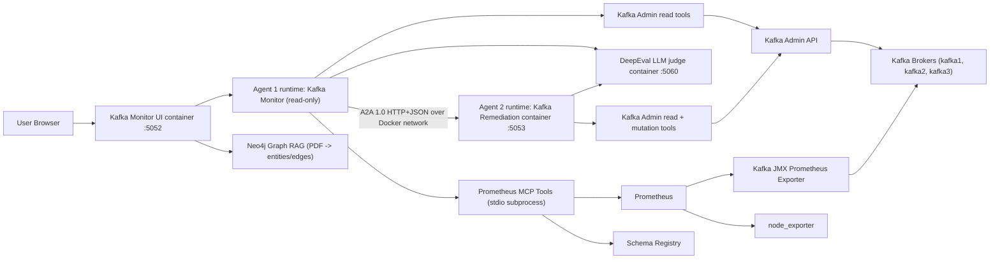

# aagentic-kafka-expert-demo 

Author: `Paul Harvener`  
Company: `Data-Blitz Inc`

## Overview
This demo runs a complete Kafka + Schema Registry stack with UI-driven Avro message production and consumption.
Consumed messages are persisted to CouchDB.
Kafka JMX data is exported to Prometheus and visualized in Grafana.
It also includes a LangChain-based Kafka Expert agent UI that uses MCP tools for Prometheus telemetry, Kafka Admin metadata/mutations, and Schema Registry inventory.

It is designed for local use with Docker Compose only.

## License
This project is controlled by the MIT License.

See:
- `./kafka-expert/LICENSE`

## What Runs
- 3-node Kafka cluster (KRaft mode, Confluent images)
- Confluent Schema Registry
- Kafka UI
- CouchDB (for consumed-message persistence)
- Kafka JMX Prometheus exporter (`/metrics`)
- node_exporter (`/metrics` for host/filesystem telemetry)
- Prometheus (scrapes JMX exporter + node_exporter)
- Prometheus alert rules for disk, request latency, ISR, and leader health
- Grafana (provisioned Prometheus datasource + dashboard)
- Neo4j (Graph RAG graph store for PDF-derived entities/edges)
- Producer UI (Avro producer + schema editor)
- Consumer UI (pretty JSON feed + consume latency)
- Kafka Monitor UI runtime (read-only LangChain agent + Prometheus/read-only Kafka Admin MCP tools)
- Kafka Remediation runtime (independent process with mutation-capable Kafka Admin MCP tools)
- Local DeepEval LLM-as-a-judge service (scores Monitor and Remediation outputs)
- Role-specific MCP tool subprocesses owned by each agent runtime
- Schema bootstrap job (registers schema at startup)

## Architecture
- Kafka brokers:
  - `localhost:19092`
  - `localhost:29092`
  - `localhost:39092`
- Schema Registry:
  - `http://localhost:8081`
- Kafka UI:
  - `http://localhost:8080`
- CouchDB:
  - `http://localhost:5984`
- JMX Exporter metrics:
  - `http://localhost:9404/metrics`
- Prometheus:
  - `http://localhost:9090`
- node_exporter metrics:
  - `http://localhost:9100/metrics`
- Grafana:
  - `http://localhost:3000` (`admin` / `demo` by default)
  - JMX dashboards:
    - `http://localhost:3000/d/kafka-jmx-overview/kafka-jmx-overview`
    - `http://localhost:3000/d/kafka-jmx-throughput/kafka-jmx-throughput`
    - `http://localhost:3000/d/kafka-jmx-request-latency/kafka-jmx-request-latency`
    - `http://localhost:3000/d/kafka-jmx-repl-health/kafka-jmx-replication-health`
    - `http://localhost:3000/d/kafka-jmx-jvm-os/kafka-jmx-jvm-and-os`
    - `http://localhost:3000/d/kafka-jmx-all-control-cluster/kafka-jmx-all-attributes-control-and-cluster`
    - `http://localhost:3000/d/kafka-jmx-all-broker-network/kafka-jmx-all-attributes-broker-and-network`
    - `http://localhost:3000/d/kafka-jmx-all-storage-coordination/kafka-jmx-all-attributes-storage-and-coordination`
    - `http://localhost:3000/d/kafka-observability-control-plane/kafka-observability-control-plane`
  - The 3 `Kafka JMX All Attributes` dashboards partition and cover all exported `kafka.*` numeric JMX attributes.
- Producer UI:
  - `http://localhost:5050`
- Consumer UI:
  - `http://localhost:5051`
- Neo4j:
  - Browser: `http://localhost:7474`
  - Bolt: `bolt://localhost:7687`
- Kafka Expert UI:
  - `http://localhost:5052`
- Kafka Remediation A2A runtime:
  - Doer UI: `http://localhost:5053`
  - Agent Card: `http://localhost:5053/.well-known/agent-card.json`
  - Send Message: `http://localhost:5053/a2a/remediation/message:send`
- DeepEval judge API:
  - Health: `http://localhost:5060/health`
  - Evaluate: `POST http://localhost:5060/api/evaluate`
  - Results: `http://localhost:5060/api/results`

## Two Separate Agent Runtimes

The demo has exactly two operational agents. Each agent runs in its own Docker
container, process, and network service:

| Agent | Responsibility | Compose service | Port | Example LLM assignment |
| --- | --- | --- | --- | --- |
| Agent 1: Monitor | Read-only Kafka cluster checks and `[GOOD]`, `[WARN]`, or `[BAD]` findings | `kafka-expert-ui` | `5052` | Ollama `gemma3:4b` |
| Agent 2: Doer | Independently verifies and repairs an explicitly selected finding | `kafka-remediation-agent` | `5053` | OpenAI `gpt-5.2` |

The Monitor sends a repair request only when the user clicks a `Fix:` action.
That request crosses the runtime boundary through the A2A 1.0 HTTP+JSON
protocol. The two agents do not share LLM clients, MCP clients, tool lists,
locks, or in-memory checkpointers.

DeepEval runs as a separate evaluator service on port `5060`. It observes and
scores both agents as an LLM-as-a-judge, but it is not a third operational
agent. The Monitor, Doer, and Judge model assignments can each be configured
independently from the UI or environment variables.

## Kafka Expert Diagram

```mermaid
flowchart LR
  U["User Browser"] --> KX["Kafka Monitor UI container :5052"]
  KX --> MON["Agent 1 runtime: Kafka Monitor (read-only)"]
  MON --> PMCP["Prometheus MCP Tools (stdio subprocess)"]
  MON --> RAMCP["Kafka Admin read tools"]
  MON -->|"A2A 1.0 HTTP+JSON over Docker network"| REM["Agent 2 runtime: Kafka Remediation container :5053"]
  MON --> JUDGE["DeepEval LLM judge container :5060"]
  REM --> JUDGE
  REM --> AMCP["Kafka Admin read + mutation tools"]
  KX --> N4J["Neo4j Graph RAG (PDF -> entities/edges)"]
  PMCP --> P["Prometheus"]
  PMCP --> SR["Schema Registry"]
  RAMCP --> K["Kafka Admin API"]
  AMCP --> K
  K --> B["Kafka Brokers (kafka1, kafka2, kafka3)"]
  P --> J["Kafka JMX Prometheus Exporter"]
  P --> N["node_exporter"]
  J --> B
```

## Compose-Only Policy
Run everything through Docker Compose.  
Do not run Python scripts directly on host.

## Quick Start
1. `cd /Users/paulharvener/workspace/demos/agentic-kafka-expert-demo`
2. Configure LLM provider in `.env`:
   - `LLM_PROVIDER=openai|ollama|huggingface` (default `openai`)
   - `LLM_TEMPERATURE=0` (float)
   - OpenAI mode:
     - `OPENAI_API_KEY=...`
     - `OPENAI_MODEL=gpt-5.3` (or another available model in your account)
     - `OPENAI_MODEL_FALLBACKS=gpt-5.2,gpt-4.1` (used automatically if requested model is unavailable)
     - Optional: `OPENAI_BASE_URL=...` for OpenAI-compatible gateways
   - Ollama mode:
     - `OLLAMA_BASE_URL=http://ollama:11434/v1` (default uses the bundled Docker service)
     - If you run Ollama on the host instead, set `OLLAMA_BASE_URL=http://host.docker.internal:11434/v1`
     - `OLLAMA_MODEL=llama3.1:8b`
     - `OLLAMA_MODEL_FALLBACKS=llama3.2:3b`
     - `OLLAMA_MODELS_DIR=/root/.ollama/models` (directory used to discover downloaded models for UI selection)
     - `OLLAMA_HOST_MODELS_DIR=/Users/paulharvener/.ollama/models` (host path bind-mounted into containers so every downloaded model is visible)
     - `OLLAMA_API_KEY` optional (placeholder accepted if unset)
   - Hugging Face mode (OpenAI-compatible endpoint required):
     - `HUGGINGFACE_OPENAI_BASE_URL=https://router.huggingface.co/v1`
     - `HUGGINGFACE_API_KEY=...` (token with inference permission)
     - `HUGGINGFACE_MODEL=openai/gpt-oss-120b` (or another chat/tool-capable router model)
     - `HUGGINGFACE_MODEL_FALLBACKS=...`
   - Neo4j Graph RAG credentials:
      - `NEO4J_USER=neo4j`
      - `NEO4J_PASSWORD=...`
      - `NEO4J_AUTH=none` (demo auto-login mode for Neo4j Browser; no username/password prompt)
      - `NEO4J_BROWSER_PUBLIC_URL=http://localhost:7474/browser/`
   - Context persistence (Kafka Expert conversation/thread memory):
      - `CONTEXT_PERSIST_TO_COUCHDB=true`
      - `COUCHDB_CONTEXT_DB=kafka_expert_context`
   - Independent two-agent LLM settings:
      - `MONITOR_LLM_PROVIDER=openai|ollama|huggingface` selects Agent 1's provider.
      - `MONITOR_MODEL=...` selects Agent 1's model.
      - `MONITOR_MODEL_FALLBACKS=...` provides Agent 1 fallback models.
      - `REMEDIATION_LLM_PROVIDER=openai|ollama|huggingface` selects Agent 2's provider.
      - `REMEDIATION_MODEL=...` selects Agent 2's model.
      - `REMEDIATION_MODEL_FALLBACKS=...` provides Agent 2 fallback models.
      - Blank agent-specific values fall back to `LLM_PROVIDER` and the selected provider's default model list.
      - `KAFKA_REMEDIATION_AGENT_PORT=5053` sets Agent 2's independent service port.
      - `A2A_REMEDIATION_TOKEN=...` sets the shared bearer token between containers; use a non-demo value outside local development.
   - Optional local DeepEval judge settings:
      - `DEEPEVAL_JUDGE_PROVIDER=openai|ollama|huggingface` selects the judge provider independently.
      - `DEEPEVAL_SERVICE_PORT=5060` exposes the local evaluation API.
      - `DEEPEVAL_JUDGE_MODEL=...` selects a dedicated judge model; blank uses the active provider model and its fallback list.
      - `DEEPEVAL_THRESHOLD=0.7` sets the default pass threshold.
      - `DEEPEVAL_AUTO_EVALUATE=true` automatically evaluates new Monitor and Remediation outputs.
3. `docker compose up -d --build --remove-orphans`
4. Open producer UI: `http://localhost:5050`
5. Open consumer UI: `http://localhost:5051`
6. Open Kafka Expert UI: `http://localhost:5052`

### Ollama (open source LLMs)
- Set `LLM_PROVIDER=ollama` in `.env` and keep the default `OLLAMA_BASE_URL=http://ollama:11434/v1`.
- Keep `OLLAMA_HOST_MODELS_DIR=/Users/paulharvener/.ollama/models` so Docker uses your existing host Ollama model store.
- After the stack is up, pull at least one model into the Ollama service, for example: `docker compose exec ollama ollama pull llama3.1:8b`.
- Update `OLLAMA_MODEL` and `OLLAMA_MODEL_FALLBACKS` to match the models you have pulled.
- Compose creates `kafka-qwen3:8b` from the installed `qwen3:8b` weights with an 8K context, large enough for the compact evidence-first Kafka assessment.
- Local CPU inference is functional but slower than hosted providers; the Monitor pre-fetches and compacts the Prometheus snapshot before invoking Ollama.

### Switch LLM at runtime
- In the Monitor UI (`http://localhost:5052`) or Doer UI (`http://localhost:5053`), click the `LLM` tab.
- The assignment chips always show the effective provider/model for `Monitor`, `Doer`, and `Judge`.
- In the Monitor UI, choose any runtime assignment. The Doer UI provisions only its own isolated runtime.
- Hit `LLM Config`, choose a provider, model, fallbacks, base URL, optional API key, and temperature, then click `Apply + Reload`.
- `Load provider models` lists locally installed Ollama models or models returned by Hugging Face's `/v1/models` endpoint.
- Add API key if needed, then click `Apply + Reload`.
- UI changes are routed to the selected independent runtime; Monitor, Doer, and Judge do not share LLM client objects.

### Doer UI
- Open `http://localhost:5053` to inspect the isolated Kafka Remediation Agent.
- The Doer Agent tab shows current health, authorized A2A task history, remediation output, and trace/token usage.
- The LLM tab provisions OpenAI, Ollama, or Hugging Face directly on the Doer runtime without reconfiguring the Monitor.
- Monitor-only Graph RAG, RAG metrics, DeepEval orchestration, and direct diagnostic chat controls are hidden.
- The Doer accepts repairs only from authenticated A2A 1.0 messages sent by the Monitor runtime.

### Test independent agent LLM configuration
- Run the full test suite: `pytest -q`
- Enforce 100% statement and branch coverage on the independent agent-assignment module:
  `pytest -q tests/test_agent_llm_config.py --cov=agent_llm_config --cov-branch --cov-report=term-missing --cov-fail-under=100`

## How To Use The Demo

### 1) Send messages manually
In Producer UI (`http://localhost:5050`):
- Click `Send One Message` (green button).
- Generated purchases randomly use `USD` (U.S. dollar) or `CNY` (Chinese yuan/renminbi).

In Consumer UI (`http://localhost:5051`):
- You will see the message displayed as pretty JSON.
- You will also see `latency_ms` (consume time minus `event_time`).

### 2) Send messages at a custom rate
In Producer UI:
- Set `Rate (seconds)` to desired value.
- Click `Start Rate Send`.
- Click `Stop` to end continuous publishing.

### 3) Edit schema from UI
In Producer UI:
- Update the schema in `Schema Editor`.
- Click `Save + Register Schema`.
- New generated messages will follow the updated schema.

### 4) Kafka two-agent operations UI
In Kafka Expert UI (`http://localhost:5052`):
- Click `Query Full Cluster State` to trigger Agent 1, the read-only Kafka Monitor Agent.
- Agent 1 calls Prometheus and read-only Kafka Admin MCP tools, then labels findings `[GOOD]`, `[WARN]`, or `[BAD]`.
- Click `Fix:` on a current warning or bad finding to hand it to Agent 2 over the A2A 1.0 HTTP+JSON protocol.
- Agent 2 independently verifies the finding, applies the smallest available Kafka Admin repair, and verifies the post-change state.
- DeepEval automatically observes completed outputs from both agents and scores answer relevancy plus Kafka operational quality.
- Use the `DeepEval Judge` tab to choose `Both agents`, `Monitor only`, or `Doer only`, change the pass threshold, run an on-demand evaluation, and inspect judge reasons.
- The status panel is updated with the latest health assessment.
- Use the `Kafka Producer` tab for an embedded producer UI (`http://localhost:5050`) to send test messages.
- Use the `Kafka Consumer` tab for an embedded consumer feed UI (`http://localhost:5051`) in dark mode.
- Use the `Grafana` tab for embedded dashboards in dark mode.
- Use the `Graph RAG` tab to upload a Kafka PDF into Neo4j, generate graph edges, and ask graph-grounded questions.
- Use the `Neo4j Browser` tab and click `Open Neo4j Browser` to navigate graph nodes/edges visually.
  - With `NEO4J_AUTH=none`, Neo4j Browser opens without credential prompts for easier demo usage.
- Use the `Kafka UI` tab and click `Open Kafka UI` to launch Kafka UI in a new browser tab.
- Use chat for Kafka-specific operational questions.
- Use `Clear Chat` to remove old chat history and reset the current cluster state panel.
- Diagnostic chat is read-only; Kafka mutations are confined to the explicit `Fix:` handoff to Agent 2.
- Non-Kafka questions are intentionally refused.

Kafka Expert API endpoints:
- `GET /api/health` returns model credential/runtime state.
- `GET /api/state` returns current status textbox text and chat history.
- `POST /api/cluster_state` triggers full-cluster Prometheus reasoning pass.
- `POST /api/chat` asks Kafka Expert a question (Kafka-only guardrail enforced).
- `POST /api/chat/clear` clears chat transcript, resets cluster status text, and rotates LangGraph thread memory.
  - Topics/partitions/consumer-groups inventory questions are answered deterministically from Kafka Admin metadata.
  - Schema Registry/subjects/data-contract questions are answered deterministically from Schema Registry REST API.
  - Mutation requests are converted into monitor findings and require a `Fix:` click before Agent 2 can act.
- `GET http://localhost:5053/.well-known/agent-card.json` publishes Agent 2's Agent Card from its own runtime.
- `POST http://localhost:5053/a2a/remediation/message:send` is Agent 2's authenticated A2A 1.0 Send Message endpoint.
- `POST /api/auto_fix` validates a clicked monitor finding, sends it to Agent 2 over A2A, and returns the completed A2A task artifact and trace.
- `GET /api/deepeval/status` returns local judge health and recent scored runs.
- `POST /api/deepeval/evaluate` evaluates the UI-selected `monitor`, `remediation`, or `both` scope using the latest outputs.
- DeepEval runs locally in Docker Compose with telemetry opted out. Judge inference uses the configured OpenAI-compatible provider (`openai`, `ollama`, or `huggingface`).
- The agents do not share LLM objects, MCP clients, tool lists, locks, or in-memory checkpointers; only A2A messages and tasks cross the process boundary.
- Graph RAG endpoints:
  - `GET /api/graphrag/status` returns Neo4j Graph RAG health and graph counters.
  - `POST /api/graphrag/ingest_pdf` ingests one uploaded PDF (`multipart/form-data`, file field `pdf`) into Neo4j and generates entity/relation edges.
  - `POST /api/graphrag/query` answers a graph-grounded question from ingested PDF knowledge.
- Model selection behavior:
  - Kafka Expert validates the requested model for the selected `LLM_PROVIDER` at startup.
  - If the requested model is unavailable, it automatically falls back through the provider-specific fallback list.
  - `GET /api/health` reports `llm_provider`, `llm_model_requested`, `llm_model`, and `llm_model_fallbacks`.
  - Legacy OpenAI fields (`openai_model*`) are also included for compatibility.

Kafka Expert response formatting and UI behavior:
- Agent responses are normalized into concise `1.`-based bullets.
- Every bullet includes one severity tag: `[GOOD]`, `[WARN]`, or `[BAD]`.
- Status bullets are color-coded in UI:
  - `[GOOD]` -> green background
  - `[WARN]` -> yellow background
  - `[BAD]` -> red background
- If a bullet is `[WARN]` or `[BAD]`, the same bullet includes a `Fix:` action.
- Status text is regular weight for readability.
- Only `Fix:` text is bold.
- `Fix:` text is clickable only on `[WARN]` and `[BAD]` findings and triggers an A2A handoff via `POST /api/auto_fix`.
- After the colored severity bullets in chat, the UI shows a short `Short answer:` summary for quick reading.

Kafka Expert cluster-state metric coverage (Prometheus MCP snapshot):
- Exporter health:
  - `kafka_jmx_exporter_up`
  - `kafka_jmx_exporter_last_poll_success`
  - `kafka_jmx_exporter_last_poll_error`
  - `kafka_jmx_exporter_last_poll_duration_seconds`
- Scrape-health and host telemetry:
  - `up{job="kafka_jmx"}`
  - `up{job="node_exporter"}`
  - `node_filesystem_avail_bytes`
  - `node_filesystem_size_bytes`
- JVM pressure:
  - `java.lang GarbageCollector CollectionTime` rate (G1 young/old)
- Request latency percentile coverage:
  - `RequestMetrics TotalTimeMs 99thPercentile` for `Produce` and `FetchConsumer`
- Controller/partition/replication health:
  - `ActiveControllerCount`
  - `OfflinePartitionsCount`
  - `UnderReplicatedPartitions`
  - `IsrShrinksPerSec`
  - `PreferredReplicaImbalanceCount`
  - `RequestQueueSize`
- Throughput and volume context:
  - `MessagesInPerSec.Count`
  - `BytesInPerSec.Count`
  - `BytesOutPerSec.Count`
  - `RequestsPerSec.Count` (Produce, FetchConsumer)
- Topic visibility:
  - `topic_inventory_count` from distinct topics in `kafka.log:type=Log,name=Size,topic=...,partition=...` (full inventory source)
  - `topic_inventory_topics` per-topic partition-series counts from `kafka.log` metrics
  - `topic_activity_count` from `BrokerTopicMetrics MessagesInPerSec OneMinuteRate` (active traffic view)
  - `topic_activity_topics` per-topic activity rates from `BrokerTopicMetrics`
- Partition visibility:
  - `partition_inventory_total` from distinct `(topic,partition)` pairs in `kafka.log` metrics
  - `partition_inventory_by_topic` partition counts by topic
- Consumer group visibility:
  - `consumer_group_count_total`
  - `consumer_group_stable`
  - `consumer_group_empty`
  - `consumer_group_preparing_rebalance`
  - `consumer_group_completing_rebalance`
- Schema Registry inventory:
  - `schema_registry_inventory` MCP tool returns global compatibility, subjects, latest versions, and data-contract metadata (schema type + field count).

Prometheus alerting coverage:
- Broker disk size threshold (`KafkaBrokerDiskUsageHigh`)
- Host disk utilization threshold from `node_exporter` (`KafkaHostDiskUsageHigh`)
- `node_exporter` scrape availability (`NodeExporterTargetDown`)
- JVM GC pressure (`KafkaJvmGcTimeHigh`)
- Broker file descriptor pressure (`KafkaFileDescriptorUsageHigh`)
- Produce/FetchConsumer request latency p99 thresholds
- Missing request-latency percentile telemetry (`KafkaRequestLatencyMetricsMissing`)
- ISR shrink rate (`KafkaIsrShrinkRateNonZero`)
- Active controller count validity (`KafkaActiveControllerCountInvalid`)
- Offline partitions (`KafkaOfflinePartitionsNonZero`)
- Under-replicated partitions (`KafkaUnderReplicatedPartitionsNonZero`)
- Preferred replica imbalance (`KafkaPreferredReplicaImbalanceNonZero`)
- Missing ISR/leader telemetry (`KafkaIsrLeaderMetricsMissing`)

Kafka Admin MCP tool coverage:
- Read tools:
  - `kafka_describe_cluster`
  - `kafka_list_topics`
  - `kafka_describe_topic`
  - `kafka_list_consumer_groups`
  - `kafka_describe_consumer_groups`
  - `kafka_describe_topic_configs`
- Mutation tools:
  - `kafka_create_topic`
  - `kafka_delete_topic`
  - `kafka_create_partitions`
  - `kafka_set_topic_config`
  - `kafka_delete_topic_config_keys`
  - `kafka_delete_consumer_groups`

## Data Output
Consumed messages are written to CouchDB database:
- `kafka_expert_consumed`
Each CouchDB document includes:
- `consumed_at`
- `written_at_utc`
- `kafka_timestamp_type`
- `kafka_timestamp_ms`
- Kafka metadata (`topic`, `partition`, `offset`, `key`)
- Original payload under `message`

Kafka JMX numeric attributes are also exposed to Prometheus as:
- `kafka_jmx_attribute_value{broker,domain,mbean,attribute}`
- Exporter health metrics (`kafka_jmx_exporter_*`)
- JMX data is stored in Prometheus (no file-based JMX snapshots).

## Runtime Services
Default `docker compose up -d` includes:
- `kafka1`, `kafka2`, `kafka3`
- `schema-registry`
- `kafka-ui`
- `couchdb`
- `kafka-jmx-prom-exporter`
- `node-exporter`
- `prometheus`
- `grafana`
- `neo4j`
- `schema-bootstrap` (one-shot init)
- `producer-ui`
- `consumer-ui`
- `kafka-expert-ui`

Optional fixed-rate CLI-style producer:
- `docker compose --profile rate-producer up -d producer-rate`

## Common Operations
- Start stack: `docker compose up -d`
- Rebuild and restart: `docker compose up -d --build`
- Stop stack: `docker compose down`
- View all logs: `docker compose logs -f`
- View consumer UI logs: `docker compose logs -f consumer-ui`
- View producer UI logs: `docker compose logs -f producer-ui`
- View Kafka Expert UI logs: `docker compose logs -f kafka-expert-ui`
- Check CouchDB health: `curl -u admin:demo http://localhost:5984/_up`
- List CouchDB docs: `curl -u admin:demo "http://localhost:5984/kafka_expert_consumed/_all_docs?include_docs=true"`
- Check JMX exporter: `curl http://localhost:9404/metrics`
- Check Prometheus targets: `curl http://localhost:9090/api/v1/targets`
- Check loaded alerting rules: `curl http://localhost:9090/api/v1/rules`
- Check active alerts: `curl http://localhost:9090/api/v1/alerts`
- Check Kafka Expert health: `curl http://localhost:5052/api/health`
- Check Neo4j browser: `curl -I http://localhost:7474`
- Trigger Kafka Expert cluster assessment: `curl -X POST http://localhost:5052/api/cluster_state -H 'Content-Type: application/json' -d '{}'`
- Ask Kafka Expert a question: `curl -X POST http://localhost:5052/api/chat -H 'Content-Type: application/json' -d '{"message":"Is the Kafka cluster healthy?"}'`
- Check Graph RAG status: `curl http://localhost:5052/api/graphrag/status`
- Ingest PDF into Graph RAG: `curl -X POST http://localhost:5052/api/graphrag/ingest_pdf -F "pdf=@/path/to/kafka.pdf"`
- Ask Graph RAG a question: `curl -X POST http://localhost:5052/api/graphrag/query -H 'Content-Type: application/json' -d '{"question":"How does Kafka handle partitions?"}'`
- Open Grafana dashboard: `http://localhost:3000/d/kafka-jmx-overview/kafka-jmx-overview`

## Troubleshooting
- If stale containers exist after service rename:
  - `docker compose up -d --remove-orphans`
- If you want a clean reset (removes containers + network):
  - `docker compose down`
  - `docker compose up -d --build --remove-orphans`
- Verify schema subject:
  - `curl http://localhost:8081/subjects`
- Verify UIs:
  - `curl -I http://localhost:5050`
  - `curl -I http://localhost:5051`
  - `curl -I http://localhost:5052`
- If Kafka Expert shows unavailable runtime:
  - Verify provider config in `.env` matches the selected `LLM_PROVIDER`.
  - Check `curl http://localhost:5052/api/health` for `llm_provider`, `llm_model`, and provider configuration flags.
  - Rebuild/restart service: `docker compose up -d --build kafka-expert-ui`
- If Kafka Expert returns OpenAI `429 insufficient_quota`:
  - Open the OpenAI platform project billing page and check current spend limit / hard cap.
  - Increase the project spend limit or add prepaid credits, then retry.
